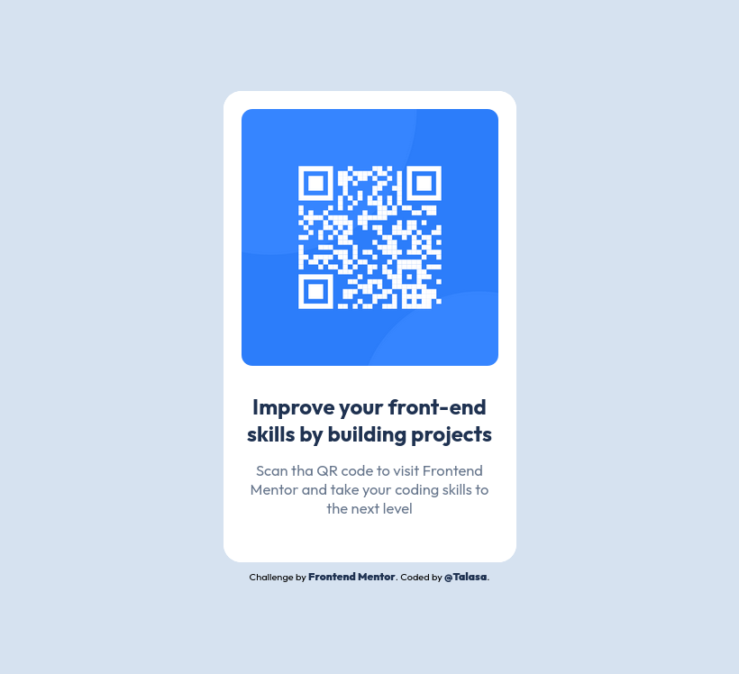

# Frontend Mentor - QR code component solution

This is a solution to the [QR code component challenge on Frontend Mentor](https://www.frontendmentor.io/challenges/qr-code-component-iux_sIO_H). 

## Table of contents

- [Overview](#overview)
  - [Screenshot](#screenshot)
  - [Links](#links)
- [My process](#my-process)
  - [Built with](#built-with)
  - [What I learned](#what-i-learned)
  - [Changes made after solution - design comparison](#changes-after-solution-design-comparison)
  - [Changes made after accessibility, HTML, CSS report](#changes-after-accessibility-html-css-report)
  - [Continued development](#continued-development)
  - [Useful resources](#useful-resources)
- [Author](#author)


## Overview

### Screenshot




### Links

- Solution URL: (https://github.com/TalasaDev/FrontendMentor-QR-code-component/settings/pages)](https://your-solution-url.com)
- Live Site URL: (https://talasadev.github.io/FrontendMentor-QR-code-component/)

## My process

### Built with

- Semantic HTML5 markup 
- CSS custom properties
- Flexbox
- Mobile-first workflow


### What I learned

- To create VARIABLES to reuse them during my coding making it more efficient.
```css
:root {
    --white: hsl(0, 0%, 100%);
    --light-gray: hsl(212, 45%, 89%);
    --grayish-blue: hsl(216, 15%, 48%);
    --blue: hsl(218, 44%, 22%);
}
```
- **Centering a DIV:**: Repeat avec moi: margin: auto, margin: auto, margin: auto,margin: auto, margin: auto, margin: auto,margin: auto, margin: auto, margin: auto,margin: auto, margin: auto, margin: auto,margin: auto, margin: auto, margin: auto,margin: auto, margin: auto, margin: auto,...
  Centering a div, in this case, the Qr component. I started with mobile-first design approach, where everything was marvelously perfect in a to-good-to-be-truth world. When changing the size of the browser, everything stayed stuck to the left side. It was super mean. Adding the property {margin: auto} in the body is the ticket to Wonderland.

```HTML
body {    
    margin: auto;    
}
```
- **Object-fit property:** sets how an image or video is resized to fit its container. It can take values like fill, contain, cover, none, and scale-down, allowing you to maintain aspect ratios or fill the space as needed.

### Changes made after solution - design comparison**.
- **Vertically and horizontally center a div**:
  
```CSS
    body {
      margin: 0;
      position: absolute;
      top: 50%;
      left: 50%;
      transform: translate(-50%, -50%);
   }
```
- **Reducing code component size**.
- **Change H1 color to --blue**.

### Changes made after accessibility, HTML, CSS report.
- **ERROR:** Use only recognized property values to ensure styles apply correctly and consistently: Changed from hsl(218, 44%, 22) to var(--blue).
  ```CSS
      .text {
          color: hsl(218, 44%, 22);
      }
  ```
- **WARNING - RESPONSIVE DESIGN.** Consider using relative units (em, rem) instead of absolute units (px, pt) to support resizing and improve accessibility.
  ```CSS
      /* Quick reminder: 1 rem = 16px  */

  ```
- **BEST PRACTICES:** 
- Use logical properties (e.g., inline-start instead of left) to support different reading directions and improve internationalization.
   ```css
         p {
         margin-top: 30px;
        }
   ```

- Consider using CSS functions like calc(), min(), and clamp() to create more responsive and flexible layouts that adapt to different viewport sizes.  


### Continued development

In the next projects, will focus in working with different layouts, not only flexbox, responsiveness, and using the proper mark up to ensure a good accessibility.

### Useful resources

- w3schools
- MDNdocs
- stackoverlow
- css tricks

## Author

- Website - [(https://www.coming-soon.com)
- Frontend Mentor - [@yourusername](https://www.frontendmentor.io/profile/TalasaDev)
- Twitter - [@really-coming-soon](https://www.twitter.com/yourusername)


